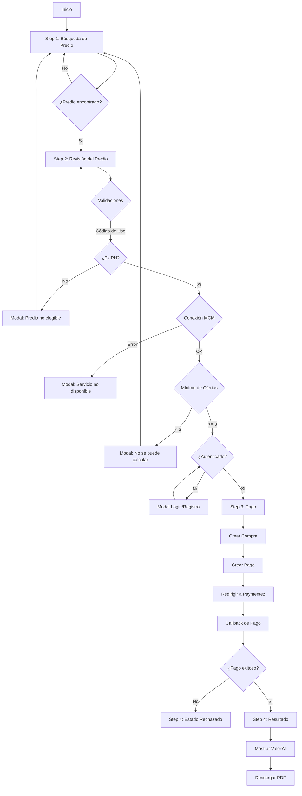

# Arquitectura ValorYa - Documentación Técnica Completa

## 📋 Tabla de Contenidos

1. [Descripción General](#descripción-general)
2. [Arquitectura del Sistema](#arquitectura-del-sistema)
3. [Stack Tecnológico](#stack-tecnológico)
4. [Flujos de Usuario](#flujos-de-usuario)
5. [Componentes y Servicios](#componentes-y-servicios)
6. [API Backend](#api-backend)
7. [Integración MCM](#integración-mcm)
8. [Sistema de Autenticación](#sistema-de-autenticación)
9. [Sistema de Pagos](#sistema-de-pagos)
10. [Gestión de Estado](#gestión-de-estado)
11. [Guards y Seguridad](#guards-y-seguridad)
12. [Generación de Reportes](#generación-de-reportes)

---

## 📖 Descripción General

**ValorYa** es una plataforma web desarrollada para la Unidad Administrativa Especial de Catastro Distrital de Bogotá que permite calcular el valor comercial de predios utilizando el **Método de Comparación de Mercado (MCM)**. 

### Características Principales

- ✅ Búsqueda de predios por CHIP, Dirección Catastral o FMI
- ✅ Visualización geográfica con mapas interactivos (Leaflet + ESRI)
- ✅ Cálculo automatizado de valor comercial
- ✅ Sistema de autenticación y registro
- ✅ Pasarela de pagos integrada (Paymentez)
- ✅ Generación de reportes PDF con avalúo completo
- ✅ Diseño responsive (mobile-first)

### Usuarios Objetivo

- Propietarios de inmuebles en Bogotá
- Entidades financieras (para avalúos en garantía)
- Notarías y curadores urbanos

---

## 🏗️ Arquitectura del Sistema

### Arquitectura General

```
┌─────────────────────────────────────────────────────────────┐
│                    FRONTEND (Angular 18+)                    │
│  ┌──────────────┐  ┌──────────────┐  ┌──────────────┐      │
│  │  ValorYa     │  │    Test      │  │   Avalúos    │      │
│  │   Module     │  │   Module     │  │  en Garantía │      │
│  └──────────────┘  └──────────────┘  └──────────────┘      │
└─────────────────────────────────────────────────────────────┘
                              │
                              ▼
┌─────────────────────────────────────────────────────────────┐
│              BACKEND API (Spring Boot + Oracle)              │
│  ┌─────────────┐  ┌─────────────┐  ┌─────────────┐        │
│  │  Catastro   │  │   Compras   │  │   Reportes  │        │
│  │  Service    │  │   Service   │  │   Service   │        │
│  └─────────────┘  └─────────────┘  └─────────────┘        │
└─────────────────────────────────────────────────────────────┘
```

### Flujo de Datos

1. **Usuario** → Frontend Angular (SPA)
2. **Frontend** → Backend API (REST)
3. **Backend** → Base de Datos Oracle (Stored Procedures)
4. **Backend** → API Externa MCM (Cálculos de valoración)
5. **Backend** → Paymentez (Pasarela de pagos)

---

## 💻 Stack Tecnológico

### Frontend

| Tecnología | Versión | Propósito |
|------------|---------|-----------|
| **Angular** | 18+ | Framework principal (Standalone Components) |
| **TypeScript** | 5.5+ | Lenguaje de programación |
| **RxJS** | 7.x | Programación reactiva |
| **Leaflet** | 1.9.x | Mapas interactivos |
| **esri-leaflet** | 3.x | Integración con ArcGIS |
| **html2canvas** | 1.4.x | Captura de mapas para PDF |
| **Bootstrap** | 5.x | Framework CSS responsive |

### Backend

| Tecnología | Versión | Propósito |
|------------|---------|-----------|
| **Spring Boot** | 3.x | Framework backend |
| **Java** | 17+ | Lenguaje de programación |
| **Oracle Database** | 19c+ | Base de datos principal |
| **JasperReports** | 6.x | Generación de reportes PDF |
| **RestTemplate** | - | Cliente HTTP para APIs externas |

### Herramientas de Desarrollo

- **Node.js** + **pnpm** - Gestión de dependencias frontend
- **Maven** - Gestión de dependencias backend
- **Git** - Control de versiones
- **VS Code** - IDE principal

---

## 👤 Flujos de Usuario

### 1. Flujo Principal: ValorYa



### 2. Flujo de Test (Sin pago real)

- Idéntico al flujo ValorYa pero sin validación de códigos de uso
- Permite testing de predios no elegibles
- No requiere pago real (mock de Paymentez)

### 3. Flujo de Avalúos en Garantía

- Módulo simplificado para entidades financieras
- Solicitud de avalúo formal con proceso diferente
- Requiere información adicional del solicitante

---

## 🧩 Componentes y Servicios

### Estructura de Carpetas Frontend

```
src/app/
├── core/                           # Funcionalidad core
│   ├── auth/                       # Autenticación
│   │   ├── services/
│   │   │   ├── auth.service.ts
│   │   │   ├── token.service.ts
│   │   │   └── auth-modal.service.ts
│   │   └── components/
│   │       ├── login-modal/
│   │       └── register-modal/
│   ├── guards/                     # Guards de rutas
│   │   ├── auth.guard.ts
│   │   ├── predio-data.guard.ts
│   │   └── test-data.guard.ts
│   ├── interceptors/
│   │   └── token.interceptor.ts    # Interceptor JWT
│   └── models/
│       └── user.model.ts
│
├── features/                       # Módulos por funcionalidad
│   ├── valor-ya/                   # Módulo principal
│   │   ├── step1/                  # Búsqueda
│   │   │   └── search-forms/
│   │   ├── step2/                  # Revisión
│   │   │   ├── predio-review/
│   │   │   └── complement-info/
│   │   ├── step3/                  # Pago
│   │   │   ├── payment/
│   │   │   └── payment-status/
│   │   ├── step4/                  # Resultado
│   │   │   └── result/
│   │   ├── components/             # Componentes compartidos
│   │   │   ├── map/
│   │   │   ├── predio-info-card/
│   │   │   └── valorya-description/
│   │   ├── services/
│   │   │   ├── valor-ya-state.service.ts
│   │   │   ├── valor-ya-stepper.service.ts
│   │   │   ├── mcm-valor-ya.service.ts
│   │   │   ├── predio.service.ts
│   │   │   ├── compras.service.ts
│   │   │   ├── payment.service.ts
│   │   │   └── reporte.service.ts
│   │   └── models/
│   │       ├── predio-data.model.ts
│   │       └── mcm-valor-ya.model.ts
│   │
│   ├── test/                       # Módulo de testing
│   │   └── [estructura similar a valor-ya]
│   │
│   └── avaluos-en-garantia/       # Módulo avalúos
│       └── [estructura propia]
│
└── shared/                         # Componentes reutilizables
    ├── components/
    │   ├── layout/
    │   │   ├── header/
    │   │   ├── footer/
    │   │   ├── page-header/
    │   │   └── service-area/
    │   └── ui/
    │       ├── button/
    │       ├── input/
    │       ├── select/
    │       ├── stepper/
    │       ├── modal/
    │       ├── loading/
    │       └── container-content/
    └── services/
        ├── loading.service.ts
        └── notification.service.ts
```

### Servicios Clave

#### 1. **ValorYaStateService** (`valor-ya-state.service.ts`)

Gestiona el estado global del flujo ValorYa usando signals de Angular.

```typescript
@Injectable({ providedIn: 'root' })
export class ValorYaStateService {
  // Signals para estado reactivo
  private predioDataSignal = signal<PredioData | null>(null);
  private valorYaResumenSignal = signal<CalcularValorYaResponse | null>(null);
  
  // Estado de búsqueda (persistido en sessionStorage)
  tipoBusqueda = signal<TipoBusqueda>(TipoBusqueda.DIRECCION);
  valorBusqueda = signal<string>('');
  
  // Estado de pago (persistido en localStorage)
  compraId = signal<number | null>(null);
  pagoId = signal<number | null>(null);
  
  // Métodos públicos
  setPredioData(data: PredioData): void { ... }
  setValorYaResumen(data: CalcularValorYaResponse): void { ... }
  reset(): void { ... }
}
```

**Persistencia:**
- `sessionStorage`: Estado temporal de búsqueda (se pierde al cerrar tab)
- `localStorage`: Datos del predio y pago (persiste entre sesiones)

#### 2. **AuthService** (`auth.service.ts`)

Gestiona autenticación con signals y JWT.

```typescript
@Injectable({ providedIn: 'root' })
export class AuthService {
  private currentUserSignal = signal<User | null>(null);
  
  readonly currentUser = this.currentUserSignal.asReadonly();
  readonly isAuthenticated = computed(() => this.currentUserSignal() !== null);
  
  // Métodos principales
  login(credentials: LoginRequest): Observable<LoginResponse> { ... }
  register(data: RegisterRequest): Observable<RegisterResponse> { ... }
  logout(): void { ... }
  
  // Recupera sesión del localStorage al iniciar
  loadUserFromStorage(): void { ... }
}
```

**Flujo de Login:**
1. Usuario ingresa credenciales
2. Backend valida y retorna JWT token
3. Token se guarda en `localStorage` vía `TokenService`
4. Todas las peticiones HTTP incluyen el token (vía `tokenInterceptor`)

#### 3. **MCMValorYaService** (`mcm-valor-ya.service.ts`)

Consume la API del Método de Comparación de Mercado.

```typescript
@Injectable({ providedIn: 'root' })
export class MCMValorYaService {
  // Procesar ofertas para un CHIP (máximo 5 para mapa)
  procesarChip(chip: string): Observable<MCMValorYAResultado> { ... }
  
  // Calcular valor final del predio
  calcularValorYa(chip: string): Observable<CalcularValorYaResponse> { ... }
  
  // Validar que existan mínimo 3 ofertas
  validarMinimoOfertas(chips: string[]): Observable<ValidacionMinimoOfertasResponse> { ... }
  
  // Test de conexión al servicio MCM
  testConexion(): Observable<TestConexionResponse> { ... }
}
```

#### 4. **ComprasService** (`compras.service.ts`)

Gestiona el proceso de compra y pago.

```typescript
@Injectable({ providedIn: 'root' })
export class ComprasService {
  // Crear compra (registra la transacción)
  crearCompra(data: CompraRequest): Observable<CompraResponse> { ... }
  
  // Crear pago asociado a la compra
  crearPago(data: PagoRequest): Observable<PagoResponse> { ... }
  
  // Actualizar estados después del callback de Paymentez
  actualizarCompraPago(data: ActualizarCompraPagoRequest): Observable<...> { ... }
  
  // Generar factura
  crearFactura(data: FacturaRequest): Observable<FacturaResponse> { ... }
}
```

#### 5. **PaymentService** (`payment.service.ts`)

Integración con Paymentez.

```typescript
@Injectable({ providedIn: 'root' })
export class PaymentService {
  // Iniciar proceso de pago (obtiene URL de Paymentez)
  initiatePayment(data: PaymentData, origin: string): Observable<PaymentResponse> { ... }
  
  // Extraer URL de redirección
  getPaymentUrl(response: PaymentResponse): string | null { ... }
}
```

---

## 🔌 API Backend

### Estructura del Backend

```
src/main/java/com/valorya/
├── controller/
│   ├── CatastroController.java        # Consultas catastrales
│   ├── CompraController.java          # Compras y pagos
│   ├── ProcesarChipsController.java   # MCM (Valor Ya)
│   └── ReporteController.java         # Generación de PDFs
├── service/
│   ├── CatastroService.java
│   ├── CompraService.java
│   └── ReporteService.java
├── dto/
│   ├── CompraRequest.java
│   ├── PagoRequest.java
│   └── [otros DTOs]
└── config/
    └── Constants.java                 # URLs y configuraciones
```

### Endpoints Principales

#### 1. **Catastro Controller** - `/api/catastro`

| Método | Endpoint | Descripción |
|--------|----------|-------------|
| GET | `/consultar?Opcion={2\|3}&Identificador={valor}` | Consultar predio por Dirección (2) o CHIP (3) |

**Ejemplo Request:**
```
GET /api/catastro/consultar?Opcion=2&Identificador=CL 10 # 5 30
```

**Ejemplo Response:**
```json
{
  "chip": "AAA0036YERJ",
  "direccion": "CL 10 # 5 30",
  "cedula_catastral": "8A 36 17 167",
  "area_construida": 37.4,
  "area_terreno": 9.7,
  "codigo_uso": "038",
  "descripcion_uso": "APARTAMENTO",
  "estrato": 3,
  "geometry": {
    "rings": [[[...coordenadas...]]]
  }
}
```

#### 2. **Compras Controller** - `/api/compras`

| Método | Endpoint | Descripción |
|--------|----------|-------------|
| POST | `/compras` | Crear nueva compra |
| POST | `/compras/pagos` | Crear pago para una compra |
| POST | `/compras/pagos/actualizar` | Actualizar estado de compra y pago |
| POST | `/compras/facturas` | Generar factura |

**Ejemplo - Crear Compra:**
```json
POST /api/compras
{
  "usuarioId": 123,
  "fechaCompra": "2025-01-15",
  "estado": "REGISTRADA",
  "uuid": "UUID-1705334567890",
  "cantidad": 1,
  "prodDetId1": "AAA0036YERJ",
  "radAgno": 2025,
  "radNum": 45678
}
```

**Response:**
```json
{
  "compraId": 789,
  "detalleId": 1011,
  "mensaje": "Compra insertada exitosamente",
  "status": "success"
}
```

**Ejemplo - Crear Pago:**
```json
POST /api/compras/pagos
{
  "compraId": 789,
  "estado": "PENDIENTE",
  "numeroTx": "TX-2025-1705334567890",
  "tipoPersona": "NATURAL",
  "banco": "BANCO UNION COLOMBIANO",
  "version": 1,
  "formaPagoProveedor": "credit_card"
}
```

**Response:**
```json
{
  "pagoId": 456,
  "mensaje": "Pago insertado exitosamente",
  "status": "success"
}
```

#### 3. **Procesar Chips Controller** - `/api/procesar-chips`

| Método | Endpoint | Descripción |
|--------|----------|-------------|
| GET | `/test-conexion` | Verificar disponibilidad del servicio MCM |
| POST | `/validar-minimo-ofertas` | Validar que existan >= 3 ofertas |
| POST | `/calcular-valorya` | Calcular valor final del predio |
| POST | `/chip-unico` | Obtener máximo 5 ofertas para el mapa |

**Ejemplo - Calcular ValorYa:**
```json
POST /api/procesar-chips/calcular-valorya
{
  "chip": "AAA0036YERJ"
}
```

**Response:**
```json
{
  "data": {
    "CHIP": "AAA0036YERJ",
    "CODIGO_USO": "038",
    "AREA_CONSTRUIDA_PREDIO": 37.4,
    "VALOR_YA": 81345000,
    "VALORYA_M2": 2174025.76,
    "LIMITE_INFERIOR": 79877850,
    "LIMITE_INFERIOR_M2": 2135754.01,
    "LIMITE_SUPERIOR": 82812150,
    "LIMITE_SUPERIOR_M2": 2214297.33,
    "CV": 1.65,
    "ofertas_utilizadas": 62501,
    "chips_procesados": 3
  },
  "mensaje": "Cálculo ValorYa completado exitosamente",
  "status": "success"
}
```

#### 4. **Reporte Controller** - `/api/reportes`

| Método | Endpoint | Descripción |
|--------|----------|-------------|
| POST | `/valorya-completo/pdf` | Generar PDF del avalúo |

**Ejemplo Request:**
```json
POST /api/reportes/valorya-completo/pdf
{
  "chip": "AAA0036YERJ",
  "imagenBase64": "data:image/png;base64,iVBORw0KG...",
  "imagenBase64Ofertas": "data:image/png;base64,iVBORw0KG..."
}
```

**Response:**
```
Content-Type: application/pdf
Content-Disposition: attachment; filename="ValorYa-AAA0036YERJ.pdf"

[Binary PDF data]
```

---

## 🔗 Integración MCM (Método de Comparación de Mercado)

### API Externa

**URL:** `vmprocondock.catastrobogota.gov.co:5000/api/procesar-chips`

### Lógica de Cálculo

El backend implementa una lógica dual según el tipo de predio:

#### Caso 1: Predios con Código de Uso 037 o 038 (PH)

1. Consultar API externa MCM con el CHIP
2. Obtener ofertas de referencia (predios similares)
3. Aplicar fórmulas de comparación:
   - **VALOR_YA** = MEDIA × AREA_CONSTRUIDA_PREDIO
   - **LÍMITE_INFERIOR** = LIM_INFERIOR × AREA_CONSTRUIDA_PREDIO
   - **LÍMITE_SUPERIOR** = LIM_SUPERIOR × AREA_CONSTRUIDA_PREDIO

#### Caso 2: Predios con Otros Códigos (no PH)

1. Ejecutar Stored Procedure `SP_CALCULAR_VALOR_POR_CHIP`
2. El SP consulta tablas de valores predefinidos según:
   - Código de Uso
   - Estrato
   - Rango de Área
3. Retorna valor calculado directamente

### Stored Procedures Oracle

#### `SP_GET_USOS_PREDIO`
```sql
-- Retorna los usos (códigos) de un predio
-- Permite detectar si es PH único o múltiples usos
PROCEDURE SP_GET_USOS_PREDIO (
  p_CHIP IN VARCHAR2,
  p_CURSOR OUT SYS_REFCURSOR
);
```

#### `SP_CALCULAR_VALOR_POR_CHIP`
```sql
-- Calcula el valor para predios NO-PH
PROCEDURE SP_CALCULAR_VALOR_POR_CHIP (
  p_CHIP IN VARCHAR2,
  o_VALOR_TOTAL OUT NUMBER,
  o_MENSAJE OUT VARCHAR2
);
```

---

## 🔐 Sistema de Autenticación

### Flujo Completo

```
1. Usuario → login(email, password)
                ↓
2. Backend → Validar credenciales en BD
                ↓
3. Backend → Generar JWT token
                ↓
4. Frontend → Guardar token en localStorage
                ↓
5. Frontend → Actualizar estado (isAuthenticated = true)
                ↓
6. Interceptor → Agregar header Authorization en cada request
                ↓
7. Backend → Validar token en cada endpoint protegido
```

### Token JWT

**Estructura:**
```json
{
  "sub": "user@example.com",
  "id": 123,
  "name": "Juan Pérez",
  "iat": 1705334567,
  "exp": 1705420967
}
```

**Storage:**
- **localStorage:** `valorya-token`, `valorya-user`
- **Expiración:** 24 horas
- **Renovación:** Automática en login

### Guards de Ruta

#### `authGuard`
```typescript
export const authGuard: CanActivateFn = () => {
  const authService = inject(AuthService);
  const router = inject(Router);

  if (authService.isAuthenticated()) {
    return true;
  }

  router.navigate(['/valor-ya/seleccionar']);
  return false;
};
```

#### `predioDataGuard`
```typescript
export const predioDataGuard: CanActivateFn = () => {
  const stateService = inject(ValorYaStateService);
  const router = inject(Router);

  const predioData = stateService.predioData();

  if (!predioData?.chip) {
    router.navigate(['/valor-ya/solicitud']);
    return false;
  }

  return true;
};
```

---

## 💳 Sistema de Pagos

### Integración con Paymentez

#### Flujo de Pago

```
1. Usuario completa formulario de pago
     ↓
2. Frontend → Crear Compra (POST /api/compras)
     ↓
3. Frontend → Crear Pago (POST /api/compras/pagos)
     ↓
4. Frontend → Iniciar Pago Paymentez (POST /api/payment/initiate)
     ↓
5. Backend → Llamar API Paymentez
     ↓
6. Backend → Retornar URL de pago
     ↓
7. Frontend → Redirigir a Paymentez (window.location.href)
     ↓
8. Usuario → Realiza pago en Paymentez
     ↓
9. Paymentez → Callback a /valor-ya/pago-status/:status
     ↓
10. Frontend → Actualizar estados (POST /api/compras/pagos/actualizar)
     ↓
11. Frontend → Redirigir a resultado
```

#### Estados de Compra

| Estado | Descripción |
|--------|-------------|
| **REGISTRADA** | Compra creada, pago pendiente |
| **COMPRADA_SIN_PAGO** | Pago rechazado o fallido |
| **COMPRADO_CON_PAGO** | Pago exitoso |
| **PENDIENTE** | Pago en revisión |
| **COMPLETADO** | Proceso finalizado con éxito |

#### Estados de Pago

| Estado | Descripción |
|--------|-------------|
| **PENDIENTE** | Esperando respuesta de pasarela |
| **EXITOSO** | Pago aprobado |
| **RECHAZADO** | Pago declinado |
| **SIN_PAGO** | No se completó el pago |

### Callback de Paymentez

**URL:** `/valor-ya/pago-status/:status`

**Parámetros:**
- `status`: `success` | `failure` | `pending` | `review`

**Acciones según status:**

| Status | Estado Pago | Estado Compra | Acción |
|--------|-------------|---------------|--------|
| `success` | EXITOSO | COMPRADO_CON_PAGO | Continuar a resultado |
| `failure` | RECHAZADO | COMPRADA_SIN_PAGO | Mostrar error |
| `pending` | PENDIENTE | REGISTRADA | Mostrar pendiente |
| `review` | PENDIENTE | REGISTRADA | Mostrar en revisión |

---

## 📊 Gestión de Estado

### Persistencia de Datos

#### localStorage

| Key | Contenido | Propósito |
|-----|-----------|-----------|
| `valorya-token` | JWT token | Autenticación |
| `valorya-user` | Objeto User | Info del usuario logueado |
| `valorya-predio-data` | Objeto PredioData | Datos completos del predio |
| `valor-ya-payment-context` | {chip, dev_reference, compraId} | Contexto del pago |

#### sessionStorage

| Key | Contenido | Propósito |
|-----|-----------|-----------|
| `valorya-busqueda-state` | {tipo, valor} | Recuperar búsqueda al recargar |
| `valorya-resultado-state` | {chip, pagoId} | Persistir resultado entre navegación |

### Signals de Angular

El proyecto usa **signals** para gestión de estado reactivo:

```typescript
// Estado reactivo con signals
private predioDataSignal = signal<PredioData | null>(null);

// Readonly para consumo externo
readonly predioData = this.predioDataSignal.asReadonly();

// Computed signals
readonly hasPredio = computed(() => this.predioDataSignal() !== null);

// Effects para side effects
constructor() {
  effect(() => {
    const predio = this.predioDataSignal();
    if (predio) {
      this.saveToLocalStorage(predio);
    }
  });
}
```

---

## 🛡️ Guards y Seguridad

### Tipos de Guards

1. **authGuard** - Valida autenticación
2. **predioDataGuard** - Valida datos de predio en estado
3. **testAuthGuard** - authGuard para módulo de test
4. **testDataGuard** - predioDataGuard para módulo de test

### Rutas Protegidas

```typescript
{
  path: 'pago',
  canActivate: [authGuard, predioDataGuard],  // Requiere ambos
  loadComponent: () => import('./payment')
},
{
  path: 'respuesta',
  canActivate: [authGuard, predioDataGuard],
  loadComponent: () => import('./result')
}
```

### Interceptor de Token

```typescript
export const tokenInterceptor: HttpInterceptorFn = (req, next) => {
  const tokenService = inject(TokenService);
  const token = tokenService.getToken();

  if (token) {
    const cloned = req.clone({
      setHeaders: {
        Authorization: `Bearer ${token}`
      }
    });
    return next(cloned);
  }

  return next(req);
};
```

---

## 📄 Generación de Reportes

### Flujo de Generación de PDF

```
1. Usuario → Click en "Descargar Avalúo"
     ↓
2. Frontend → Mostrar loading spinner
     ↓
3. Frontend → Capturar mapas como imágenes Base64
     │  ├─ Mapa del Predio (html2canvas)
     │  └─ Mapa de Ofertas (html2canvas)
     ↓
4. Frontend → Enviar request con imágenes
     POST /api/reportes/valorya-completo/pdf
     ↓
5. Backend → Cargar template JasperReports
     ↓
6. Backend → Compilar datos del predio desde BD
     ↓
7. Backend → Insertar imágenes Base64 en reporte
     ↓
8. Backend → Generar PDF (JasperReports)
     ↓
9. Backend → Retornar Blob PDF
     ↓
10. Frontend → Ocultar loading
     ↓
11. Frontend → Descargar archivo
      (createObjectURL + click programático)
```

### Captura de Mapas

**Desafío:** En dispositivos móviles, los mapas tienen dimensiones pequeñas, lo que resulta en imágenes de baja calidad en el PDF.

**Solución Implementada:**

```typescript
async captureMapAsBase64(): Promise<string | null> {
  const container = this.mapContainer.nativeElement;

  // 1. Guardar dimensiones originales
  const originalWidth = container.style.width;
  const originalHeight = container.style.height;

  // 2. Forzar dimensiones fijas (767x432)
  container.style.width = '767px';
  container.style.height = '432px';
  container.style.aspectRatio = 'unset';

  // 3. Re-renderizar mapa
  this.map.invalidateSize();
  await new Promise(resolve => setTimeout(resolve, 300));

  // 4. Capturar con html2canvas
  const canvas = await html2canvas(container, {
    useCORS: true,
    width: 767,
    height: 432
  });

  // 5. Restaurar dimensiones originales
  container.style.width = originalWidth;
  container.style.height = originalHeight;
  this.map.invalidateSize();

  return canvas.toDataURL('image/png');
}
```

### Estructura del PDF

**Secciones:**
1. **Encabezado** - Logo UAECD, título, fecha
2. **Información del Predio**
   - CHIP, Dirección, Cédula Catastral
   - Área construida, Área de terreno
   - Código de uso, Estrato
3. **Mapa del Predio** (imagen capturada)
4. **Mapa de Ofertas de Referencia** (imagen capturada)
5. **Resumen del Avalúo**
   - Ofertas utilizadas
   - Área construida
   - Coeficiente de Variación (CV)
   - Límites inferior y superior
6. **Valoración Final**
   - **VALOR YA** (destacado)
   - Valor por m²
7. **Pie de página** - Información de contacto

---

## 🎨 Diseño y UX

### Colores Principales

| Color | Hex | Uso |
|-------|-----|-----|
| **Azul Primario** | `#3366CC` | Botones, enlaces, headers |
| **Azul Oscuro** | `#004884` | Texto, iconos |
| **Amarillo** | `#FEB400` | Hover, loading spinner, destacados |
| **Blanco** | `#FFFFFF` | Fondos |
| **Gris Claro** | `#F3F4F6` | Bordes, fondos secundarios |

### Responsive Design

**Breakpoints:**
- **Mobile:** < 768px
- **Tablet:** 768px - 1024px
- **Desktop:** > 1024px

**Mobile-First:**
- Columnas apiladas en mobile
- Grid de 1 columna
- Navegación colapsable
- Botones full-width

**Bootstrap 5:**
- Sistema de grid responsive
- Utilidades de espaciado
- Clases de visibilidad (`d-none d-lg-flex`)
- Order utilities para reordenar elementos en mobile

---

## 📝 Validaciones de Negocio

### Validaciones en Step 2 (Revisión del Predio)

#### 1. Validación de Código de Uso

```typescript
private validarCodigoUso(predio: PredioData): boolean {
  const CODIGOS_PERMITIDOS = ['037', '038'];
  return CODIGOS_PERMITIDOS.includes(predio.codigoUso);
}
```

**Códigos permitidos:**
- **037** - Casa en Propiedad Horizontal
- **038** - Apartamento

**Si no cumple:**
- Modal "Predio no elegible para ValorYa"
- Contacto de soporte
- Regreso a búsqueda

#### 2. Validación de Conexión MCM

```typescript
private validarConexionMCM(): Observable<boolean> {
  return this.apiService.testConexion().pipe(
    map(resp => resp.estado === 'disponible'),
    catchError(() => of(false))
  );
}
```

**Si no cumple:**
- Modal "Servicio no disponible"
- Información de mantenimiento
- Contacto de soporte

#### 3. Validación de Mínimo de Ofertas

```typescript
private validarMinimoOfertas(chip: string): Observable<boolean> {
  return this.apiService.validarMinimoOfertas([chip]).pipe(
    map(resp => resp.valido && resp.chips_procesados >= 3),
    catchError(() => of(false))
  );
}
```

**Criterio:** Mínimo 3 ofertas de referencia procesadas

**Si no cumple:**
- Modal "No podemos calcular el valor"
- Explicación técnica
- Regreso a búsqueda

---

## 🔄 Limpieza de Datos

### Al Cerrar Sesión

```typescript
logout(): void {
  // Limpiar tokens
  this.tokenService.removeToken();
  
  // Limpiar localStorage
  localStorage.removeItem('valorya-user');
  localStorage.removeItem('valorya-predio-data');
  localStorage.removeItem('valor-ya-payment-context');
  
  // Limpiar sessionStorage
  sessionStorage.removeItem('valorya-busqueda-state');
  sessionStorage.removeItem('valorya-resultado-state');
  
  // Resetear signals
  this.currentUserSignal.set(null);
  
  // Redirigir
  this.router.navigate(['/valor-ya/seleccionar']);
}
```

### Al Completar Flujo

```typescript
onNuevaConsulta(): void {
  // Resetear estado
  this.stateService.reset();
  this.stepperService.reset();
  
  // Navegar al inicio
  this.router.navigate(['/valor-ya/seleccionar']);
}
```

---

## 🧪 Módulo de Test

### Diferencias con ValorYa

| Aspecto | ValorYa | Test |
|---------|---------|------|
| **Código de Uso** | Solo 037 y 038 | Cualquier código |
| **Pago** | Real con Paymentez | Mock (no real) |
| **Propósito** | Producción | Testing y desarrollo |
| **Validaciones** | Todas activas | Relajadas |

### Uso del Módulo Test

1. Acceder a `/test/seleccionar`
2. Buscar cualquier predio (sin restricciones)
3. Revisar y continuar (sin validaciones estrictas)
4. Proceso de pago simulado
5. Ver resultado con datos reales del MCM

---

## 📞 Información de Contacto

**Soporte Técnico:**
- 📞 +57 601 234 7600 ext. 7600
- ✉️ buzon-correspondencia@catastrobogota.gov.co
- 🕐 Lunes a Viernes de 8:00 AM a 4:30 PM

**Sede Principal:**
- 📍 Av. Carrera 30 No. 25 - 90, Torre B Piso 2
- 🏙️ Bogotá D.C., Colombia
- 📮 Código Postal: 111311

---

## 📚 Referencias

- [Angular Documentation](https://angular.dev)
- [Leaflet Documentation](https://leafletjs.com)
- [Spring Boot Documentation](https://spring.io/projects/spring-boot)
- [Oracle PL/SQL Documentation](https://docs.oracle.com/en/database/oracle/oracle-database/)
- [Paymentez Documentation](https://paymentez.github.io)
- [JasperReports Documentation](https://community.jaspersoft.com)

---

**Última Actualización:** Diciembre 2025  
**Versión del Documento:** 1.0
